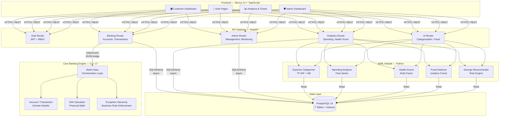
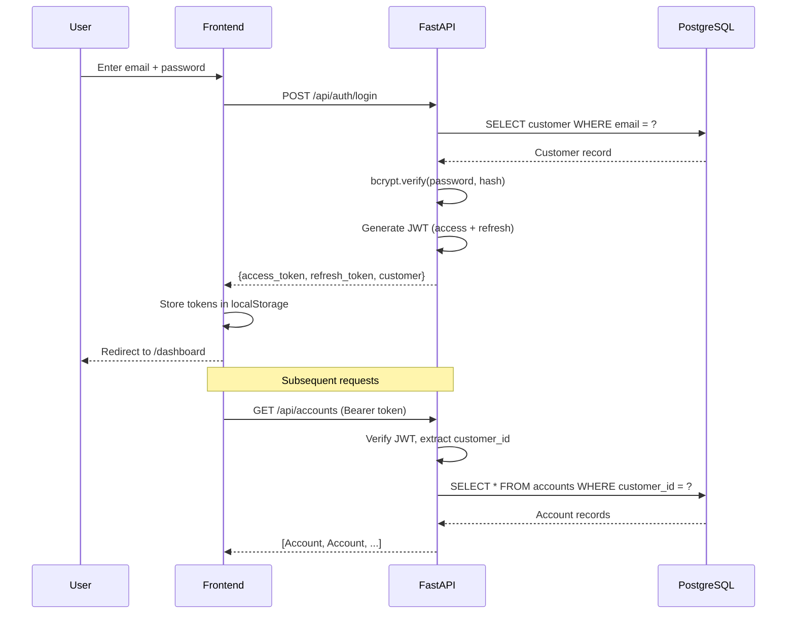
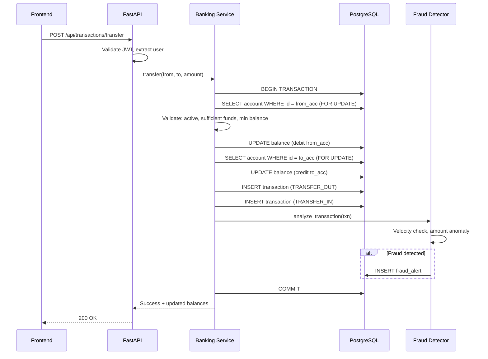
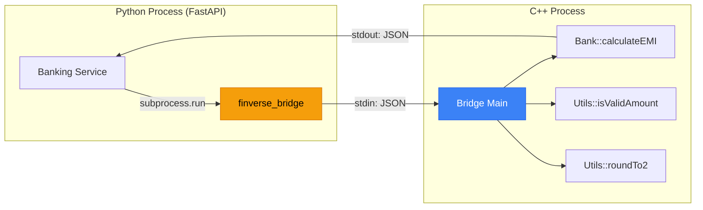
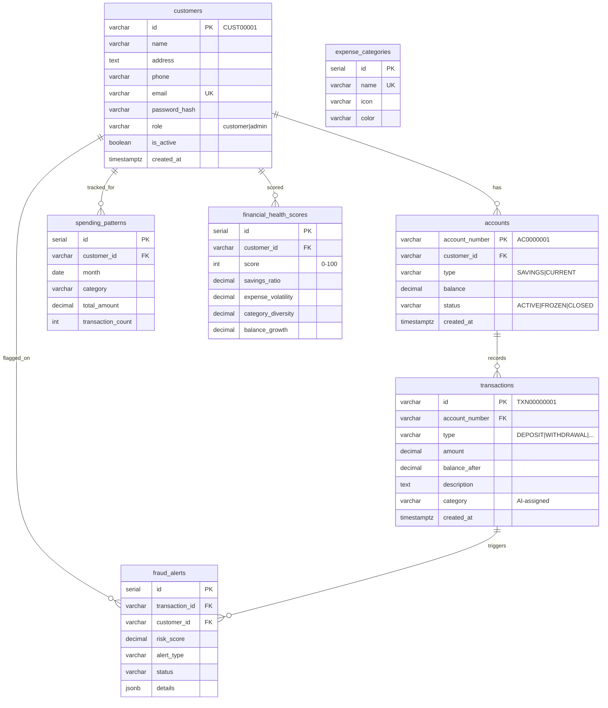
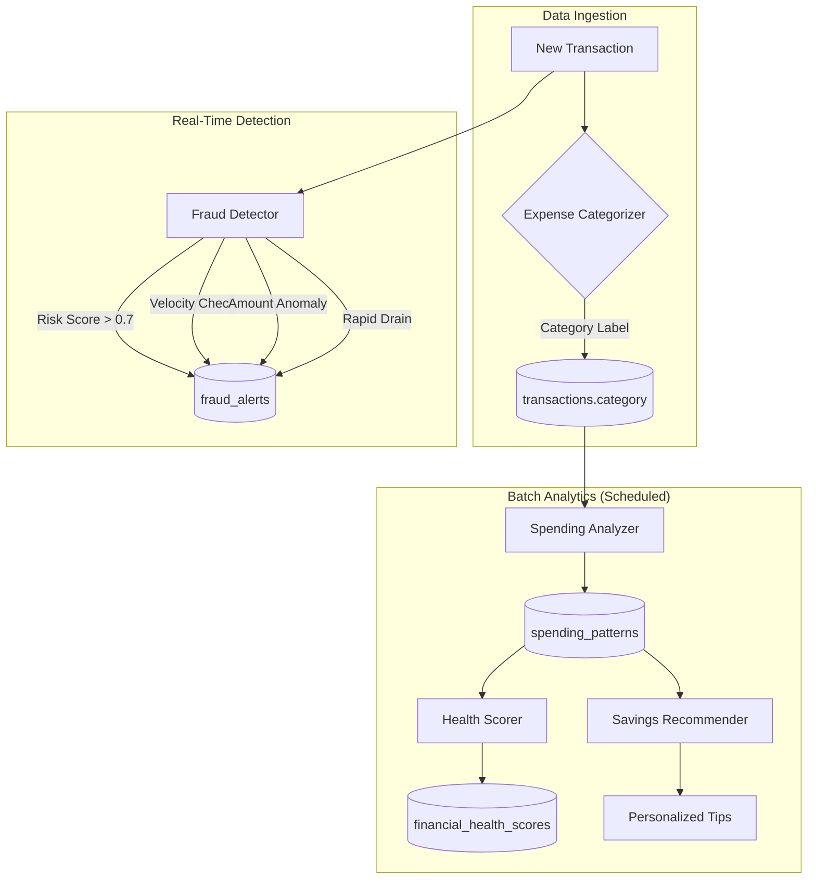

# FinVerse — System Architecture

## High-Level Architecture

## Layer Responsibility Matrix

| Layer | Technology | Responsibility | Deployed As |
|-------|-----------|----------------|-------------|
| **Presentation** | Next.js 14, TypeScript, TailwindCSS, Recharts | User interface, data visualization, client-side routing | Docker container (port 3000) |
| **API Gateway** | FastAPI, Pydantic | Request validation, JWT auth, RBAC, rate limiting | Docker container (port 8000) |
| **Business Logic** | Python services + C++ engine | Banking rules, transaction processing, EMI calculation | Embedded in API container |
| **AI/ML** | scikit-learn, pandas, numpy | Expense categorization, fraud detection, health scoring | Embedded in API container |
| **Persistence** | PostgreSQL 16, SQLAlchemy 2.0 | ACID transactions, analytical queries, data integrity | Docker container (port 5432) |

## Authentication Flow

## Transaction Processing Flow

## C++ Integration Architecture

The C++ bridge (`finverse_bridge`) is a standalone executable that:
1. Reads a JSON command from stdin
2. Delegates to the existing C++ `Bank` class methods
3. Returns a JSON response to stdout

This preserves the original C++ codebase untouched while enabling Python interop.

## Database Schema (ERD)

## AI/ML Pipeline Architecture

