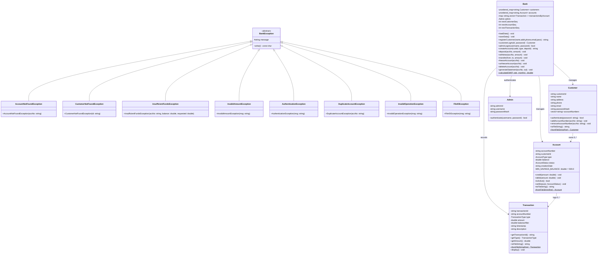
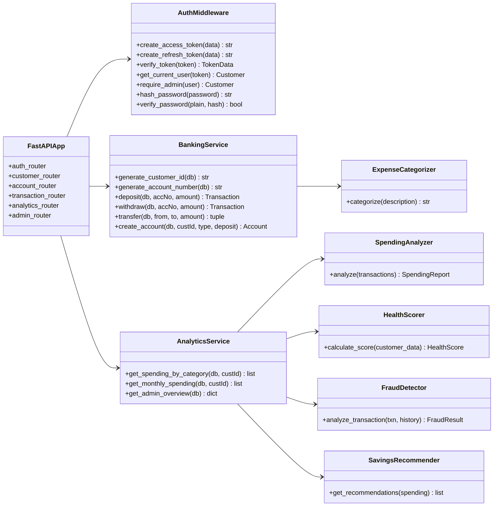
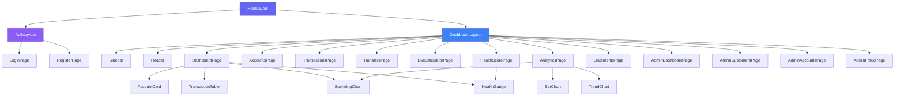

# FinVerse — UML Class Diagrams

## Core Banking Engine (C++)

```mermaid
classDiagram
    direction TB

    class BankException {
        <<abstract>>
        #string message
        +what() const char*
    }

    class AccountNotFoundException {
        +AccountNotFoundException(accNo: string)
    }

    class CustomerNotFoundException {
        +CustomerNotFoundException(id: string)
    }

    class InsufficientFundsException {
        +InsufficientFundsException(accNo: string, balance: double, requested: double)
    }

    class InvalidAmountException {
        +InvalidAmountException(msg: string)
    }

    class AuthenticationException {
        +AuthenticationException(msg: string)
    }

    class DuplicateAccountException {
        +DuplicateAccountException(accNo: string)
    }

    class InvalidOperationException {
        +InvalidOperationException(msg: string)
    }

    class FileIOException {
        +FileIOException(msg: string)
    }

    BankException <|-- AccountNotFoundException
    BankException <|-- CustomerNotFoundException
    BankException <|-- InsufficientFundsException
    BankException <|-- InvalidAmountException
    BankException <|-- AuthenticationException
    BankException <|-- DuplicateAccountException
    BankException <|-- InvalidOperationException
    BankException <|-- FileIOException

    class Transaction {
        -string transactionId
        -string accountNumber
        -TransactionType type
        -double amount
        -double balanceAfter
        -string timestamp
        -string description
        +getTransactionId() string
        +getType() TransactionType
        +getAmount() double
        +toFileString() string
        +fromFileString(line)$ Transaction
        +display() void
    }

    class Account {
        -string accountNumber
        -string customerId
        -AccountType type
        -double balance
        -AccountStatus status
        -string creationDate
        -MIN_SAVINGS_BALANCE: double = 500.0
        +credit(amount: double) void
        +debit(amount: double) void
        +isActive() bool
        +setStatus(s: AccountStatus) void
        +toFileString() string
        +fromFileString(line)$ Account
    }

    class Customer {
        -string customerId
        -string name
        -string address
        -string phone
        -string email
        -string passwordHash
        -vector~string~ accountNumbers
        +authenticate(password: string) bool
        +addAccountNumber(accNo: string) void
        +removeAccountNumber(accNo: string) void
        +toFileString() string
        +fromFileString(line)$ Customer
    }

    class Admin {
        -string adminId
        -string username
        -string passwordHash
        +authenticate(username, password) bool
    }

    class Bank {
        -unordered_map~string,Customer~ customers
        -unordered_map~string,Account~ accounts
        -map~string,vector~Transaction~~ transactionsByAccount
        -Admin admin
        -int nextCustomerSeq
        -int nextAccountSeq
        -int nextTransactionSeq
        +loadData() void
        +saveData() void
        +registerCustomer(name,addr,phone,email,pass) string
        +customerLogin(id, password) Customer*
        +adminLogin(username, password) bool
        +createAccount(custId, type, deposit) string
        +deposit(accNo, amount) void
        +withdraw(accNo, amount) void
        +transfer(from, to, amount) void
        +freezeAccount(accNo) void
        +unfreezeAccount(accNo) void
        +deleteAccount(accNo) void
        +generateStatement(accNo, out) void
        +calculateEMI(P, rate, months)$ double
    }

    Bank --> Customer : manages
    Bank --> Account : manages
    Bank --> Transaction : records
    Bank --> Admin : authenticates
    Customer --> Account : owns 0..*
    Account --> Transaction : logs 0..*
```

## Backend API Layer (Python)

```mermaid
classDiagram
    direction LR

    class FastAPIApp {
        +auth_router
        +customer_router
        +account_router
        +transaction_router
        +analytics_router
        +admin_router
    }

    class AuthMiddleware {
        +create_access_token(data) str
        +create_refresh_token(data) str
        +verify_token(token) TokenData
        +get_current_user(token) Customer
        +require_admin(user) Customer
        +hash_password(password) str
        +verify_password(plain, hash) bool
    }

    class BankingService {
        +generate_customer_id(db) str
        +generate_account_number(db) str
        +deposit(db, accNo, amount) Transaction
        +withdraw(db, accNo, amount) Transaction
        +transfer(db, from, to, amount) tuple
        +create_account(db, custId, type, deposit) Account
    }

    class AnalyticsService {
        +get_spending_by_category(db, custId) list
        +get_monthly_spending(db, custId) list
        +get_admin_overview(db) dict
    }

    class ExpenseCategorizer {
        +categorize(description) str
    }

    class SpendingAnalyzer {
        +analyze(transactions) SpendingReport
    }

    class HealthScorer {
        +calculate_score(customer_data) HealthScore
    }

    class FraudDetector {
        +analyze_transaction(txn, history) FraudResult
    }

    class SavingsRecommender {
        +get_recommendations(spending) list
    }

    FastAPIApp --> AuthMiddleware
    FastAPIApp --> BankingService
    FastAPIApp --> AnalyticsService
    BankingService --> ExpenseCategorizer
    AnalyticsService --> SpendingAnalyzer
    AnalyticsService --> HealthScorer
    AnalyticsService --> FraudDetector
    AnalyticsService --> SavingsRecommender
```

## Frontend Component Hierarchy

```mermaid
graph TD
    A[RootLayout] --> B[AuthLayout]
    A --> C[DashboardLayout]

    B --> D[LoginPage]
    B --> E[RegisterPage]

    C --> F[Sidebar]
    C --> G[Header]
    C --> H[DashboardPage]
    C --> I[AccountsPage]
    C --> J[TransactionsPage]
    C --> K[TransfersPage]
    C --> L[EMICalculatorPage]
    C --> M[AnalyticsPage]
    C --> N[HealthScorePage]
    C --> O[StatementsPage]

    C --> P[AdminDashboardPage]
    C --> Q[AdminCustomersPage]
    C --> R[AdminAccountsPage]
    C --> S[AdminFraudPage]

    H --> T[AccountCard]
    H --> U[TransactionTable]
    H --> V[SpendingChart]
    H --> W[HealthGauge]

    M --> V
    M --> X[BarChart]
    M --> Y[TrendChart]

    N --> W

    style A fill:#6366f1,color:#fff
    style C fill:#3b82f6,color:#fff
    style B fill:#8b5cf6,color:#fff
```
